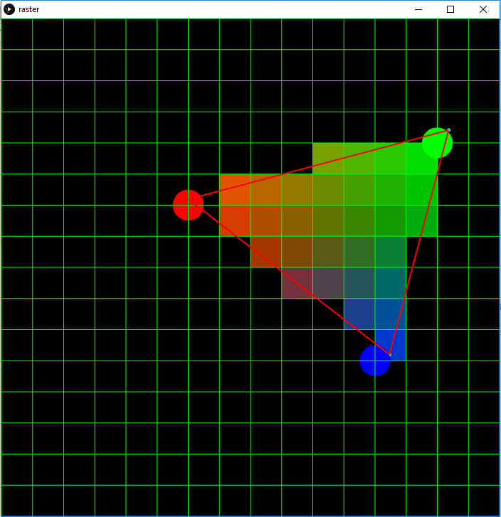
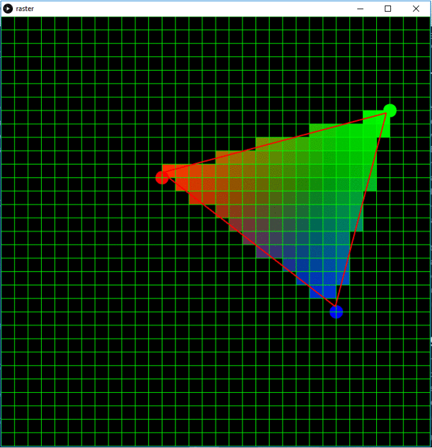

# Taller raster

## Propósito

Comprender algunos aspectos fundamentales del paradigma de rasterización.

## Tareas

Emplee coordenadas baricéntricas para:

1. Rasterizar un triángulo;
2. Implementar un algoritmo de anti-aliasing para sus aristas; y,
3. Hacer shading sobre su superficie.

Implemente la función ```triangleRaster()``` del sketch adjunto para tal efecto, requiere la librería [frames](https://github.com/VisualComputing/framesjs/releases).

## Integrantes

Máximo 3.

Complete la tabla:

|            Integrante            |   github nick   |
|----------------------------------|-----------------|
| Laura Paola Cerón Martinez       | lpceronm        |
| Camilo Andrés Dajer Piñerez      | trum7           |
| Sebastian David Moreno Bernal    | sdmorenob       |
| Cristian Camilo Orjuela Velandia | CristianOrjuela |

## Discusión

Se logró obtener la rasterización de un triángulo generado aleatoriamente haciendo uso de las librerías [frames](https://github.com/VisualComputing/framesjs/releases) y [proscene](https://github.com/remixlab/proscene). Luego se realizó la implementación de dos téctnicas de anti-aliasing conocidas como SSAA y posfiltrado mediante el uso de un filtro cónico. Por último se uso el modelo de iluminación shading con el objetivo de interpolar los colores de los vértices del triángulo sobre la grilla de modo tal que la transición de los colores fuese suave.

### Rendering

A continuación se presenta la rasterización de un triángulo haciendo uso de distintos tamaños de grilla:



En donde se pueden apreciar mayor definición del triángulo a mayor cantidad de "píxeles" generados.

### Anti-aliasing
Las técnicas usadas para la implementación del anti-aliasing fueron las siguientes:
#### Posfiltrado:
Consiste en aumentar la frecuencia de muestreo utilizada para el submuestreo. En este caso se hizo uso de una escena *offscreen* en la cual se dividió cada uno de los "píxeles" en 100 sub-píxeles y se determinó la proporción del "píxel" que se encuentra dentro del triángulo para posteriormente mostrarlo en la escena con un brillo proporcional a la coordenadas baricéntricas.



#### SuperSampling Anti-Aliasing (SSAA):
A partir de la implementación del SuperSampling Anti-Aliasing (técnica espacial que reduce el efecto de aliasing), permite a grandes rasgos suavizar los bordes dentados y pixelados de una escena renderizada particular. En este caso, se trató de reducir el defecto a partir del mejoramiento de la calidad de la imagen mediante la reducción del espaciado y procesado en cada uno de los "píxeles". Esto representó un consumo elevado de recursos debido al procesamiento y cálculo de varios valores.

En ese sentido, tras realizar algunas operaciones matemáticas y aumentar la partición de un "píxel" en el frame, se obtuvo una calidad superior de la imagen que es X más grande según lo deseado (2 veces, 4 veces u 8 veces según se defina el incremento de pasos).

### Shading
La representación de este mecanismo dentro de la escena se basó en la interpolación de los colores de acuerdo a su posición dentro del triángulo y su cercanía a los vértices. En este caso, se utilizaron los colores RGB ( Red, Green, Blue) para visualizar de mejor manera el contenido de color.
Se hizo la conversión del espacio cartesiano a baricéntrico con el propósito de obtener los coeficientes *alpha*, *beta*, *gamma* los cuales fueron utilizados para determinar el rango de color apropiado para pintar el "píxeles".

## Dificultades
Las dificultades presentadas en este proceso se fundamentaron en el entendimiento y compresión particular de los límites de rasterización, pues la ubicación en cada uno de los "píxeles" impedían el avance y desarrollo. Adicionalmente, el descubrimiento e implementación de las técnicas conllevaron problemas de diseño y codificación por la valoración específica de los "píxeles" y su ubicación dentro del triángulo.

## Funcionalidades Adicionales

| Nombre                     | Tecla |
|----------------------------|-------|
| Posfiltrado, Anti-aliasing | 'a'   |
| SSAA, Anti-aliasing        | 'b'   |
| Aumento resolución, SSAA   | 's'   |

## Referencias

- [Rasterización - 1](  https://www.scratchapixel.com/lessons/3d-basic-rendering/rasterization-practical-implementation/rasterization-stage )

- [Rasterización - 2](  https://fgiesen.wordpress.com/2013/02/08/triangle-rasterization-in-practice/ )

- [Anti-aliasing - 1](  https://www.youtube.com/watch?v=hqi0114mwtY )

- [Anti-aliasing - 2]( http://acacia.ual.es/profesor/LIRIBARNE/AIG/antialiasing/tecnicas.html )

- [Anti-aliasing - SSAA](  https://www.softzone.es/2016/08/26/antialiasing-que-es-y-que-diferencia-hay-entre-ssaa-fxaa-y-msaa/ )

- [SuperSampling]( https://en.wikipedia.org/wiki/Supersampling)

- [Shading](  http://www3.cs.stonybrook.edu/~qin/courses/graphics/graphics-illumination-shading.pdf )

- [Brillo y Shading](http://www.ics.uci.edu/~majumder/VC/classes/intro.pdf)

- [Coordenadas baricéntricas]( https://elcodigografico.wordpress.com/2014/03/29/coordenadas-baricentricas-en-triangulos/ )

## Entrega

* Modo de entrega: [Fork](https://help.github.com/articles/fork-a-repo/) la plantilla en las cuentas de los integrantes (de las que se tomará una al azar).
* Plazo: 1/4/18 a las 24h.